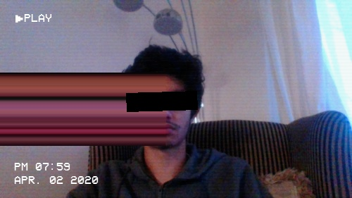
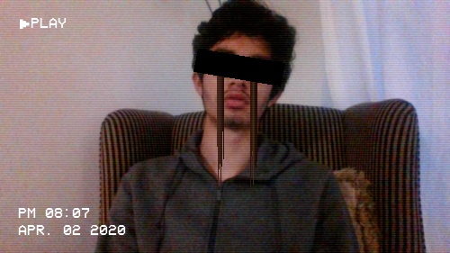

# live-glitch




This project uses Python and OpenCV to apply [glitch art](https://en.wikipedia.org/wiki/Glitch_art)
style effects in real time, using the webcam.

## Features/Effects
- VHS date text (`v` key)
- Scanlines (`v` key)
- Face dragging (`f` key)
  - `/` key - Flip orientation
  - Left arrow - drag to the left/up
  - Right arrow - drag to the right/down
  - Up and down arrows - move line that is dragged
- Face glitch (`g` key)
  - `/` key - Flip orientation
  - Up and down arrows - change glitching speed
- Tears (`t` key)
- Screenshot (`s` key)
- Record video (`r` key to start and then stop)

## Commandline
```
❯ python3 main.py --help
usage: main.py [-h] [-w RESIZE_WIDTH] [-d DISPLAY_WIDTH]

optional arguments:
  -h, --help            show this help message and exit
  -w RESIZE_WIDTH, --resize-width RESIZE_WIDTH
                        The internal image width for processing.
  -d DISPLAY_WIDTH, --display-width DISPLAY_WIDTH
                        The width of the image displayed on the screen.
```
No options are required, I would recommend just running it as is, and changing
DISPLAY_WIDTH if the output is too small.


## Similar projects
- VaporWaveArt ([article](https://towardsdatascience.com/computer-vision-for-vaporwave-art-32a330c827ee), [repo](https://github.com/TimChinenov/VaporWaveArt))
by @TimChinenov. This project helped inspire and direct a lot of what I've done here.
  - Not live, operates on static images
  - Adds vaporwave style icons/imagery and text on top
  
## Features to add
- Maybe icons/imagery
- Random VHS-style rolling glitch, where a whole top or bottom section is shifted a bit to the left or right
- Eye removal
- Test on platforms other than Linux and Python 3.8


## License
GPL version 3. See [LICENSE](./LICENSE) for details.